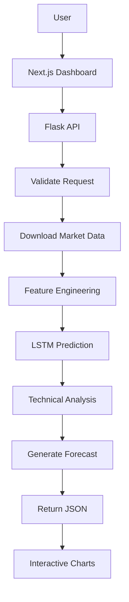

<div align="center">

# 🧠 NeuroTrade OS

### AI-Powered Stock Market Forecasting & Financial Intelligence Platform

An end-to-end financial analytics platform that combines **deep learning**, **technical analysis**, and **interactive data visualization** to forecast stock prices and provide actionable market insights.


</div>

---

# Overview

NeuroTrade OS is a full-stack AI application that predicts stock market trends using a custom LSTM forecasting pipeline while providing institutional-style financial analytics through an interactive web interface.

The project combines machine learning, financial data processing, REST APIs, and modern frontend technologies into a unified platform capable of analyzing historical market data, generating forecasts, and visualizing technical indicators.

---

# Features

### AI Forecasting
- LSTM-based time series prediction
- Multi-day price forecasting
- Model performance metrics
- Trend probability estimation

### Technical Analysis
- Moving Averages
- RSI
- Volume Analysis
- Trend Detection
- Support & Resistance Levels
- Market Momentum Analysis

### Market Intelligence Dashboard
- Interactive financial charts
- Stock comparison
- Watchlist management
- Forecast visualization
- Institutional-style dashboard

### Backend Services
- RESTful Flask API
- Model inference endpoints
- Data preprocessing pipeline
- Financial data collection
- Prediction artifact generation

---

# Tech Stack

| Category | Technologies |
|----------|--------------|
| Frontend | Next.js 14, React 18, TypeScript |
| Styling | Tailwind CSS |
| Animation | Framer Motion |
| Visualization | Recharts, Lightweight Charts, Three.js, React Three Fiber |
| State Management | Zustand |
| Data Fetching | TanStack Query |
| Backend | Python, Flask |
| Machine Learning | TensorFlow, Keras |
| Data Science | NumPy, Pandas, Scikit-Learn |
| Financial Data | Yahoo Finance (yFinance) |
| Deployment | Vercel, Docker |

---

# System Architecture

```text
                    +-----------------------+
                    |    Next.js Frontend   |
                    |  React + TypeScript   |
                    +----------+------------+
                               |
                         REST API Calls
                               |
                               ▼
                  +-------------------------+
                  |      Flask Backend      |
                  | Prediction API Layer    |
                  +-----------+-------------+
                              |
      +-----------------------+----------------------+
      |                                              |
      ▼                                              ▼
Market Data Pipeline                         AI Prediction Engine
(yFinance, Pandas)                       TensorFlow LSTM Model
      |                                              |
      +-----------------------+----------------------+
                              |
                              ▼
                    Technical Analysis Engine
                              |
                              ▼
                    Forecast & Analytics API
                              |
                              ▼
                     Interactive Dashboard
```

---

# Machine Learning Pipeline

```text
Historical Market Data
          │
          ▼
 Data Cleaning & Processing
          │
          ▼
 Feature Engineering
          │
          ▼
 Data Normalization
          │
          ▼
Sequence Generation
          │
          ▼
 Stacked LSTM Network
          │
          ▼
 Future Price Prediction
          │
          ▼
 Performance Evaluation
          │
          ▼
 REST API Response
```

---

# Project Structure

```text
NeuroTrade/
│
├── src/                          # Next.js frontend
│   ├── app/
│   ├── components/
│   ├── hooks/
│   ├── services/
│   ├── store/
│   └── lib/
│
├── stock-prediction-frontend/
│   └── api/                      # Flask backend
│
├── model_training/
│   ├── pipeline.py
│   └── model_training_and_prediction.py
│
├── data/
│   └── data_fetching.py
│
├── utils/
│   ├── risk_analysis.py
│   ├── trend_signals.py
│   └── visualization.py
│
├── core/
│   ├── config.py
│   ├── logging.py
│   └── errors.py
│
├── docs/
│   ├── API.md
│   ├── ARCHITECTURE.md
│   └── DEPLOYMENT.md
│
└── deployment/
    ├── Dockerfile
    ├── Procfile
    └── vercel.json
```

---

# Application Flow



---

# REST API

## Health Check

```
GET /health
```

Returns application status.

---

## Stock Prediction

```
POST /predict
```

Example request

```json
{
  "symbols": ["AAPL", "NVDA"]
}
```

Example response

```json
{
  "predictions": {},
  "technical_analysis": {},
  "metrics": {},
  "request_id": "..."
}
```

---

# Core Components

## Frontend

- Dashboard
- Landing Page
- Forecast Workspace
- Stock Comparison
- Watchlist
- Interactive Charts
- 3D Visual Components

---

## Backend

- Prediction API
- Technical Analysis Engine
- Data Processing Pipeline
- Forecast Generation
- Artifact Storage
- Error Handling
- Logging

---

## Machine Learning

- Time Series Forecasting
- LSTM Neural Network
- Feature Engineering
- Model Evaluation
- Performance Metrics

---

# Performance Metrics

The forecasting model reports:

- Root Mean Squared Error (RMSE)
- Mean Absolute Error (MAE)
- R² Score
- Directional Accuracy
- Normalized RMSE

---

# Installation

### Clone Repository

```bash
git clone https://github.com/USERNAME/neurotrade.git
cd neurotrade
```

### Install Frontend

```bash
npm install
```

### Install Backend

```bash
pip install -r stock-prediction-frontend/api/requirements.txt
```

### Start Development

```bash
npm run dev
```

---

# Technologies Used

### Frontend

- Next.js 14
- React
- TypeScript
- Tailwind CSS
- Framer Motion
- Three.js
- React Three Fiber
- Zustand
- TanStack Query
- Recharts

### Backend

- Flask
- Python
- TensorFlow
- Keras
- Pandas
- NumPy
- Scikit-Learn
- yFinance

---

# Future Improvements

- User authentication
- Portfolio tracking
- Real-time WebSocket updates
- News sentiment analysis
- Transformer-based forecasting models
- Reinforcement learning strategies
- Cloud deployment pipeline
- Model versioning

---

# Disclaimer

This project is intended for educational and research purposes only. Forecasts generated by the model should not be considered financial advice.


### License

MIT
