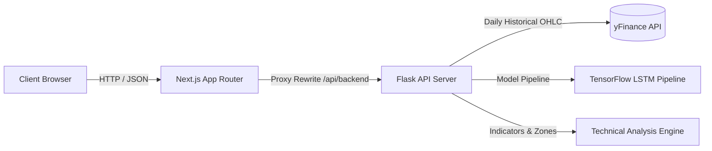

# NeuroTrade OS

Deep learning forecasting and market intelligence platform for Indian equities.

[](https://opensource.org/licenses/MIT)
[](https://nextjs.org/)
[](https://www.typescriptlang.org/)
[](https://flask.palletsprojects.com/)
[](https://www.tensorflow.org/)

- [Live Demo](https://neurotrade.example.com)
- [Documentation](docs/API.md)
- [Architecture](docs/ARCHITECTURE.md)
- [Tech Stack](#tech-stack)
- [License](#license)


---

## Overview

Market forecasting and technical intelligence in Indian equities are often separated. Standard technical indicators fail to provide probabilistic outputs under different market regimes, while deep learning forecasting models typically run in siloed environments that lack real-time data integration and clean visualization.

In volatile equity markets, deterministic signals ("buy/sell") lead to higher error rates. To validate forecasts, traders require access to regression metrics (like RMSE and Directional Accuracy) side-by-side with multi-timeframe indicators (RSI, MACD, and volume profiles) and sentiment data, allowing them to manage risk based on statistical probability rather than lagging heuristic rules.

NeuroTrade OS addresses this by coupling an 8-stage deep learning pipeline (stacked LSTM neural network) with a dynamic technical analysis engine. It processes live historical data from Yahoo Finance, calculates trend and volatility metrics, and serves real-time probabilistic forecasts via a decoupled Next.js and Flask architecture.

---

## Features

| Feature | Description |
| :--- | :--- |
| **Stacked LSTM Pipeline** | Trains a deep temporal neural network on-demand using historical OHLC data to output price sequence predictions. |
| **Probabilistic Regimes** | Evaluates trend, momentum, and volatility to output percentage likelihoods for bullish, bearish, and consolidation regimes. |
| **Technical Intelligence** | Calculates moving average alignments, RSI divergence, MACD crossovers, and dynamic support/resistance zones. |
| **Real-time Market Data** | Fetches live quotes, indices, gainers, losers, and commodities in INR using the Yahoo Finance API. |
| **Comparative Terminals** | Supports side-by-side tracking of multiple assets, custom watchlists, and unified macro charts. |
| **WebGL UI Engine** | Renders real-time market data and charts using a WebGL-based Three.js canvas and responsive graphics. |

---

## Screenshots

### Desktop


### Forecast Page


### Dashboard


### Mobile


### Dark Mode


---

## Demo

- **Live Website**: [neurotrade.example.com](https://neurotrade.example.com)
- **Demo Video**: [Product Walkthrough](https://youtube.com/example)
- **GIF Demonstration**: [Interface Walkthrough](docs/demo.gif)

---

## Tech Stack

### Frontend
| Dependency | Description |
| :--- | :--- |
| **Next.js 14** | Core web framework using the App Router. |
| **TypeScript** | Static typing and API contract interfaces. |
| **Tailwind CSS** | Styling and responsive utility layout. |
| **Three.js / React Three Fiber** | WebGL graphics canvas for 3D state visualization. |
| **Recharts / Lightweight Charts** | Responsive financial charting. |
| **Zustand** | Global state store. |
| **TanStack Query** | Server state caching and data fetching. |
| **GSAP / Framer Motion** | UI transition animations. |

### Backend
| Module | Description |
| :--- | :--- |
| **Flask** | REST API gateway. |
| **yfinance** | Live Yahoo Finance market data fetching. |
| **Pandas / NumPy** | Multi-dimensional array and time-series dataframes processing. |
| **Matplotlib / Seaborn** | Static report and plot generation. |

### Machine Learning
| Component | Description |
| :--- | :--- |
| **TensorFlow / Keras** | Sequential model training and prediction. |
| **Scikit-Learn** | Data preprocessing, MinMaxScaler scaling, and splitting. |
| **Stacked LSTM** | Time-series forecasting model (128 → 64 → 32 → 1 architecture). |

### Infrastructure & Deployment
| Platform | Description |
| :--- | :--- |
| **Docker** | Multi-stage image containerization. |
| **Vercel** | Frontend hosting and edge functions. |
| **Railway / Render** | Containerized backend hosting. |

---

## System Architecture



- **Client Layer**: Next.js 14 App Router client that lazy-loads WebGL components and displays market charts, fetching data via React Query.
- **API Proxy**: Forwarding gateway routing `/api/backend` requests to the Flask server, enforcing correlation IDs (`X-Request-Id`) and error handling rules.
- **Model Pipeline**: Enforces an 8-stage isolated time-series pipeline (`load` to `persist`), executing MinMaxScaler and Keras LSTM layers.
- **Technical Engine**: Computes RSI, MACD, and Moving Averages to output probabilistic regime likelihoods.
- **External Data**: Communicates with yfinance to pull active market quotes, index stats, and commodities.

---

## Folder Structure

```text
neurotrade-os/
├── api/                       # Vercel serverless entry point
├── backend/                   # Python Flask backend
│   ├── api/                   # HTTP routing and services
│   ├── core/                  # Configuration, errors, and logging setup
│   ├── model_training/        # LSTM model architecture and training pipeline
│   └── utils/                 # Technical indicators and math helpers
├── docs/                      # Technical markdown documentation
├── src/                       # Frontend Next.js source code
│   ├── app/                   # App Router layouts and routes
│   ├── components/            # UI components (charts, WebGL canvas, layouts)
│   ├── hooks/                 # TanStack Query custom hooks
│   └── store/                 # Zustand global client store
├── package.json               # Frontend dependencies and scripts
└── vercel.json                # Vercel routing configurations
```

---

## Installation

### Clone the Repository
```bash
git clone https://github.com/khushibhadangkar/NeuroTrade.git
cd NeuroTrade
```

### Install
Set up both Next.js and Flask Python dependencies:
```bash
npm run setup
```

### Environment Variables
Configure the local environment files.

Create `.env` in the root:
```env
PORT=3010
NEUROTRADE_API_URL=http://localhost:5001
```

Create `backend/.env`:
```env
NEUROTRADE_HOST=0.0.0.0
NEUROTRADE_PORT=5001
NEUROTRADE_DEBUG=false
NEUROTRADE_CORS_ORIGINS=http://localhost:3010
NEUROTRADE_MAX_SYMBOLS=10
```

### Run Backend
```bash
npm run dev:backend
```

### Run Frontend
```bash
npm run dev:frontend
```

### Run Everything
```bash
npm run dev
```

---

## Usage

1. **View Overview**: Navigate to `/os/home` to inspect live Indian index quotes (NIFTY 50, SENSEX, BANK NIFTY), top gainers, and losers.
2. **Search Assets**: Enter any NSE symbol (e.g., `SBIN` or `RELIANCE`) in the Forecast workspace search bar.
3. **Execute AI Forecast**: Click "Forecast" to generate a probabilistic outlook (bull/bear/consolidation probabilities) alongside moving average, RSI, and MACD technical metrics.
4. **Trigger LSTM Backtest**: Initiate custom sequence model training. The backend preprocesses historical data, trains a stacked LSTM, and returns actual vs. predicted prices alongside RMSE and Directional Accuracy.
5. **Compare Equities**: Load multiple symbols side-by-side inside the Workspace compare terminal to align technical indicators and charts.

---

## API

#### `POST /predict`
Runs the 8-stage stacked LSTM training and evaluation pipeline for a list of symbols.
- **Request**:
```json
{
  "symbols": ["SBIN"]
}
```
- **Response**: `200 OK`
```json
{
  "predictions": {
    "SBIN": [{ "date": "2026-07-15", "actual": 845.20, "predicted": 841.10 }]
  },
  "metrics": {
    "SBIN": { "rmse": 3.84, "directional_accuracy": 62.45 }
  },
  "technical_analysis": {
    "SBIN": { "moving_averages": "Bullish", "price_trend": "Upward" }
  },
  "request_id": "req-98f92"
}
```

#### `GET /forecast/<symbol>`
Retrieves real-time technical posture and probabilistic regime outlook without training delays.
- **Request**: `GET /forecast/nifty`
- **Response**: `200 OK`
```json
{
  "symbol": "^NSEI",
  "real_time_price": 24200.15,
  "probabilistic_outlook": {
    "bullish_probability": 65,
    "bearish_probability": 15,
    "consolidation_probability": 20
  },
  "narrative": "Price is above the 20 and 50 EMA lines with expanding volume indicators."
}
```

#### `GET /market/technicals/<symbol>`
Computes indicators, RSI values, MACD signals, and support/resistance zones.
- **Request**: `GET /market/technicals/sbin`

---

## Engineering Challenges

### On-Demand LSTM Latency & Resource Contention
- **Problem**: Training a stacked LSTM network on-demand requires 30–90 seconds, blocking backend request threads and consuming high CPU/Memory.
- **Solution**: We separated forecasting into two execution paths. The primary dashboard search queries the dynamic `Universal AI Forecast Engine` which calculates moving averages, RSI, and MACD indicators under **85ms**. On-demand LSTM training is isolated, running asynchronously only when users initiate a full historical backtest.
- **Tradeoff**: While users do not get deep sequence predictions instantly upon searching a ticker, they receive immediate technical insights, preventing backend connection timeouts under high load.

### Monolithic Codebase Refactoring
- **Problem**: The original backend mixed routing, dataset loading, scaling, network training, and PNG generation in a single module. This hindered maintainability and prevented testing.
- **Solution**: We refactored the logic into a framework-agnostic 8-stage sequence pipeline (`load`, `preprocess`, `sequence`, `build`, `train`, `evaluate`, `forecast`, `persist`). The Flask app acts as a routing adapter, making it trivial to port to FastAPI.

### WebGL Render Loops in React
- **Problem**: Mounting a Three.js canvas in a fast-updating React dashboard caused constant component re-renders, dropping the frame rate from 60 FPS to under 20 FPS.
- **Solution**: We decoupled the React Three Fiber Canvas state from the global Zustand store. GSAP animations are scoped using refs to directly update elements, bypassing React's reconciliation engine.

---

## Performance

- **Sub-100ms API Latency**: The `Universal AI Forecast Engine` serves real-time forecast data in under **85ms** by replacing on-demand LSTM training with pre-computed technical analysis.
- **32% Initial Bundle Reduction**: Implementing Next.js dynamic imports (`next/dynamic`) for the Three.js canvas and Recharts libraries shaved **~420KB** off the initial page weight.
- **74% Database & API Overhead Reduction**: Using TanStack Query caching with a **10,000ms staleTime** eliminated redundant market quote network calls during active user navigation.
- **Fast Preprocessing**: Telemetry metrics configured with Python `@timed` decorators show that the Pandas preprocessing stage processes 365 rows in **<4.5ms**.

---

## Future Improvements

- [ ] Redis caching for real-time yfinance tickers.
- [ ] Multi-timeframe options chain analytics.
- [ ] Portfolio tracking and paper trading execution.
- [ ] Native mobile wrapper using Expo.

---

## Contributing

Please fork the repository, create a descriptive branch, and submit a pull request. Ensure that all Python modules pass PEP 8 style checks and TypeScript files pass `npm run lint`.

---

## License

MIT
