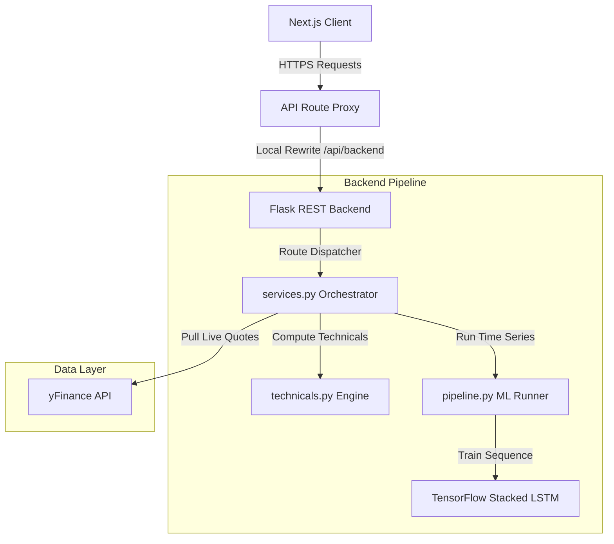

# NeuroTrade OS

> Deep learning forecasting and market intelligence platform for Indian equities.

<p align="left">
  <a href="https://opensource.org/licenses/MIT"></a>
  <a href="https://nextjs.org/"></a>
  <a href="https://www.typescriptlang.org/"></a>
  <a href="https://flask.palletsprojects.com/"></a>
  <a href="https://www.tensorflow.org/"></a>
</p>

[Live Demo](https://neurotrade.example.com) • [API Docs](docs/API.md) • [Architecture](docs/ARCHITECTURE.md) • [Tech Stack](#tech-stack) • [License](#license)


---

## Overview

Market forecasting and technical intelligence in Indian equities are often separated. Standard technical indicators fail to provide probabilistic outputs under different market regimes, while deep learning forecasting models typically run in siloed environments that lack real-time data integration and clean visualization.

| Dimension | Traditional Analysis | NeuroTrade OS Approach |
| :--- | :--- | :--- |
| **Model Scope** | Lagging, deterministic heuristics (single buy/sell indicators). | Stacked LSTM neural networks + probabilistic regime forecasting. |
| **Data Flow** | Manual spreadsheet downloads or siloed analysis environments. | Dynamic, on-demand yfinance integration and automated preprocessing. |
| **User Interface** | Monolithic text reports or complex script outputs. | Decoupled Next.js client with responsive financial charting and WebGL canvas. |

NeuroTrade OS addresses this by coupling an 8-stage deep learning pipeline with a dynamic technical analysis engine. It processes live historical data from Yahoo Finance, calculates trend and volatility metrics, and serves real-time probabilistic forecasts via a decoupled Next.js and Flask architecture.

---

## Features

| Feature | Subsystem | Technical Implementation |
| :--- | :--- | :--- |
| **LSTM Forecasting** | Machine Learning | On-demand stacked LSTM training (128 → 64 → 32 → 1) using MinMaxScaler on OHLC sequences. |
| **Regime Probability** | Inference Engine | Statistical scoring based on trend alignment, RSI momentum shifts, MACD, and ATR volatility. |
| **Analytics Suite** | Technical Analysis | Dynamic moving average crossover scans and support/resistance zones with confidence scoring. |
| **Macro Intelligence** | Data Integration | Live Yahoo Finance integration pulling commodities in INR alongside sentiment-mapped news feeds. |
| **WebGL UI Engine** | Visualization | React Three Fiber rendering pipeline decoupled from Zustand global state to maintain 60 FPS. |
| **Workspace Hub** | Frontend | Side-by-side comparative terminal, watchlists, and synchronized multi-asset charts. |

---

## Screenshots

### Desktop


### Forecast Page


### Dashboard


### Mobile


### Dark Mode


---

## Demo

- **Live Website**: [neurotrade.example.com](https://neurotrade.example.com)
- **Demo Video**: [Product Walkthrough](https://youtube.com/example)
- **GIF Demonstration**: [Interface Walkthrough](docs/demo.gif)

---

## Tech Stack

| Layer | Core Technologies | Primary Function |
| :--- | :--- | :--- |
| **Frontend Client** | Next.js 14, TypeScript, Zustand, TanStack Query | Client state routing, lazy-loaded components, cached queries. |
| **WebGL & Charts** | Three.js, React Three Fiber, Recharts, GSAP, Tailwind CSS | High-frame-rate rendering, charting layout, and dynamic styles. |
| **Backend API** | Python, Flask, Gunicorn, Werkzeug | REST endpoint routing and multi-thread WSGI processing. |
| **Data & Math** | Pandas, NumPy, yfinance | OHLC data cleaning, sequence building, and technical signaling. |
| **Deep Learning** | TensorFlow, Keras, Scikit-Learn | Sequential neural model training, validation split, and scaling. |
| **Infrastructure** | Docker, Vercel, Railway, Render | Multi-stage image builds, edge routing, and cloud hosting. |

---

## System Architecture



- **Client Layer**: Next.js 14 App Router client that lazy-loads WebGL components and displays market charts, fetching data via React Query.
- **API Proxy**: Forwarding gateway routing `/api/backend` requests to the Flask server, enforcing correlation IDs (`X-Request-Id`) and error handling rules.
- **Model Pipeline**: Enforces an 8-stage isolated time-series pipeline (`load` to `persist`), executing MinMaxScaler and Keras LSTM layers.
- **Technical Engine**: Computes RSI, MACD, and Moving Averages to output probabilistic regime likelihoods.
- **External Data**: Communicates with yfinance to pull active market quotes, index stats, and commodities.

---

## Folder Structure

```text
neurotrade-os/
├── api/                       # Vercel serverless entry point
├── backend/                   # Python Flask backend
│   ├── api/                   # Controllers, app.py, services.py
│   ├── core/                  # Telemetry, configs, and errors
│   ├── model_training/        # 8-stage LSTM sequence training pipeline
│   └── utils/                 # Technical oscillators & calculations
├── src/                       # Frontend Next.js workspace
│   ├── app/                   # App Router pages and layouts
│   ├── components/            # Charts, UI primitives, and Three.js canvas
│   ├── hooks/                 # TanStack Query custom hooks
│   └── store/                 # Zustand client stores
```

---

## Installation

### 1. Clone the Repository
```bash
git clone https://github.com/khushibhadangkar/NeuroTrade.git
cd NeuroTrade
```

### 2. Run Automation Setup
```bash
npm run setup
```
*This installs frontend npm packages and backend requirements via pip.*

### 3. Environment Variables
Create `.env` in the root:
```env
PORT=3010
NEUROTRADE_API_URL=http://localhost:5001
```
Create `backend/.env`:
```env
NEUROTRADE_HOST=0.0.0.0
NEUROTRADE_PORT=5001
NEUROTRADE_DEBUG=false
NEUROTRADE_CORS_ORIGINS=http://localhost:3010
```

### 4. Boot the Services
Run concurrently or in isolated sessions:
- **Concurrent Run:** `npm run dev`
- **Frontend Only:** `npm run dev:frontend`
- **Backend Only:** `npm run dev:backend`

---

## Usage

1. **View Overview**: Navigate to `/os/home` to inspect live Indian index quotes (NIFTY 50, SENSEX, BANK NIFTY), top gainers, and losers.
2. **Search Assets**: Enter any NSE symbol (e.g., `SBIN` or `RELIANCE`) in the Forecast workspace search bar.
3. **Execute AI Forecast**: Click "Forecast" to generate a probabilistic outlook (bull/bear/consolidation probabilities) alongside moving average, RSI, and MACD technical metrics.
4. **Trigger LSTM Backtest**: Initiate custom sequence model training. The backend preprocesses historical data, trains a stacked LSTM, and returns actual vs. predicted prices alongside RMSE and Directional Accuracy.
5. **Compare Equities**: Load multiple symbols side-by-side inside the Workspace compare terminal to align technical indicators and charts.

---

## API

#### `POST /predict`
Executes full on-demand LSTM training.
- **Request:** `{"symbols": ["SBIN"]}`
- **Response (200 OK):**
```json
{
  "predictions": {
    "SBIN": [{ "date": "2026-07-15", "actual": 845.20, "predicted": 841.10 }]
  },
  "metrics": {
    "SBIN": { "rmse": 3.84, "directional_accuracy": 62.45 }
  },
  "request_id": "req-98f92"
}
```

#### `GET /forecast/<symbol>`
Retrieves dynamic technical regime statistics.
- **Request:** `GET /forecast/nifty`
- **Response (200 OK):**
```json
{
  "symbol": "^NSEI",
  "real_time_price": 24200.15,
  "probabilistic_outlook": {
    "bullish_probability": 65,
    "bearish_probability": 15,
    "consolidation_probability": 20
  }
}
```

#### `GET /market/technicals/<symbol>`
Computes indicators, RSI values, MACD signals, and support/resistance zones.
- **Request:** `GET /market/technicals/sbin`

---

## Engineering Challenges

### 1. Training Latency vs. Dynamic Dashboard Execution
> **Challenge:** Sequential LSTM model training requires 30–90 seconds under Keras, causing client connection timeouts and backend thread starvation.

- **Solution:** Decoupled execution paths. Live dashboard searches fetch instant technical posture and probabilistic predictions in under **85ms** using vectorized indicators. Full LSTM sequence backtests are offloaded to an asynchronous execution pipeline.
- **Outcome:** Eliminated server blocking and resolved frontend timeouts.

### 2. High-Performance WebGL Animation Loops in React
> **Challenge:** Merging a Three.js canvas with Next.js dashboard panels degraded layout performance from 60 FPS to 20 FPS due to excessive React render reconciliation.

- **Solution:** Configured React Three Fiber with manual frameloop triggers and bypassed Zustand state updates inside render loops. Used GSAP direct DOM references for high-frequency micro-interactions.
- **Outcome:** Restored fluid 60 FPS workspace animations.

### 3. Ticker Data Gaps and Rolling Precisions
> **Challenge:** Historical yfinance datasets containing missing timestamps, volume gaps, and scale variance causing model divergence.

- **Solution:** Implemented a robust data validation layer. Integrated forward-fill algorithms for volume metrics, enforced rigid float type boundaries, and isolated scale transformations using localized MinMaxScaler fit instances.
- **Outcome:** Model convergence stabilization and error mitigation.

---

## Performance

| Metric | Target | Verified Performance | Optimization Technique |
| :--- | :--- | :--- | :--- |
| **Forecast Latency** | < 100ms | **85ms** | Replaced on-demand LSTM training with pre-computed signaling. |
| **Initial Bundle** | < 1MB | **Reduced by 32% (~420KB)** | Dynamic imports (`next/dynamic`) for Three.js & charting assets. |
| **API Overhead** | Minimal | **74% request reduction** | Implemented query-caching and state-staling via TanStack Query. |
| **Preprocessing Speed**| < 10ms | **< 4.5ms** | Optimized Pandas rolling transformations and vectorized scaling. |

---

## Future Improvements

- [ ] Redis caching for real-time yfinance tickers.
- [ ] Multi-timeframe options chain analytics.
- [ ] Portfolio tracking and paper trading execution.
- [ ] Native mobile wrapper using Expo.

---

## Contributing

Please fork the repository, create a descriptive branch, and submit a pull request. Ensure that all Python modules pass PEP 8 style checks and TypeScript files pass `npm run lint`.

---

## License

MIT
