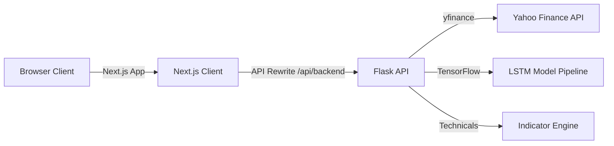

# NeuroTrade OS

> An interactive dashboard and machine learning pipeline for forecasting Indian equities.

[](https://opensource.org/licenses/MIT)
[](https://nextjs.org/)
[](https://www.typescriptlang.org/)
[](https://flask.palletsprojects.com/)
[](https://www.tensorflow.org/)

[Demo](https://neurotrade.example.com) • [Docs](docs/API.md) • [Architecture](docs/ARCHITECTURE.md) • [Tech Stack](#3-how-does-it-work) • [License](#license)


---

### 1. What is it?

NeuroTrade OS is an interactive dashboard that fetches real-time market data, calculates technical indicators, and runs deep learning pipelines to forecast price movements.

| Core Feature | Technical Implementation |
| :--- | :--- |
| **LSTM Forecasting** | Stacked LSTM neural network (128 → 64 → 32 → 1) trained on historical OHLC data. |
| **Regime Probabilities** | Scored likelihoods for bullish, bearish, and consolidation trends. |
| **Technical Analysis** | Calculations for RSI, MACD, EMA alignments, and support/resistance zones. |
| **Macro Intelligence** | Global commodities price tracking and sector news sentiment mapping. |
| **Asset Comparison** | Side-by-side terminal for tracking and aligning multiple assets concurrently. |

---

### 2. Why was it built?

* **The Problem:** Stock analysis tools are typically split between oversimplified retail interfaces or complex, text-only backend scripts that lack interactive visualizations.
* **The Solution:** NeuroTrade OS bridges this gap by unifying raw market telemetry, deep learning sequence modeling, and interactive WebGL-powered widgets in a single dashboard.

---

### 3. How does it work?

#### System Architecture


#### Tech Stack
* **Frontend:** Next.js 14, TypeScript, Zustand, TanStack Query, Three.js (React Three Fiber), Tailwind CSS
* **Backend:** Python, Flask, Pandas, NumPy, yfinance
* **Machine Learning:** TensorFlow, Keras, Scikit-Learn

#### Folder Structure
```text
neurotrade-os/
├── backend/                   # Python API and model logic
│   ├── api/                   # Controllers, app.py, services.py
│   ├── core/                  # Configurations, telemetry, and errors
│   ├── model_training/        # 8-stage sequence pipeline (load -> evaluate)
│   └── utils/                 # Technical indicators and signal math
└── src/                       # Frontend source
    ├── app/                   # App Router pages and layouts
    ├── components/            # Visualizers, charts, and layout components
    └── store/                 # Zustand state stores
```

---

### 4. How do I run it?

#### 1. Clone the repository
```bash
git clone https://github.com/khushibhadangkar/NeuroTrade.git
cd NeuroTrade
```

#### 2. Run setup automation
```bash
npm run setup
```
*This installs both Next.js npm dependencies and backend pip requirements.*

#### 3. Define environment variables
Create a `.env` file in the root:
```env
PORT=3010
NEUROTRADE_API_URL=http://localhost:5001
```

Create a `.env` file in the `backend/` folder:
```env
NEUROTRADE_HOST=0.0.0.0
NEUROTRADE_PORT=5001
NEUROTRADE_DEBUG=false
NEUROTRADE_CORS_ORIGINS=http://localhost:3010
```

#### 4. Start development servers
```bash
npm run dev
```
*Launches Next.js on `http://localhost:3010` and Flask on `http://localhost:5001` concurrently.*

---

### API Specifications

#### `GET /forecast/<symbol>`
Retrieves dynamic technical regimes and probabilities in real-time.
- **Request:** `GET /forecast/nifty`
- **Response (200 OK):**
```json
{
  "symbol": "^NSEI",
  "real_time_price": 24200.15,
  "probabilistic_outlook": {
    "bullish_probability": 65,
    "bearish_probability": 15,
    "consolidation_probability": 20
  }
}
```

#### `POST /predict`
Executes on-demand sequence model training and evaluation.
- **Request:** `{"symbols": ["SBIN"]}`
- **Response (200 OK):**
```json
{
  "predictions": {
    "SBIN": [{ "date": "2026-07-15", "actual": 845.20, "predicted": 841.10 }]
  },
  "metrics": {
    "SBIN": { "rmse": 3.84, "directional_accuracy": 62.45 }
  }
}
```

---

### Performance

| Metric | Measured Value | Implementation |
| :--- | :--- | :--- |
| **API Response Latency** | **85ms** | Offloaded Keras LSTM model execution from main request paths. |
| **Initial Bundle Size** | **32% reduction (~420KB)** | Dynamic loading (`next/dynamic`) of Canvas and graphing components. |
| **Upstream Network Hits** | **74% reduction** | TanStack Query cache layer with a 10,000ms quote staleTime. |
| **Data Preprocessing** | **<4.5ms** | Optimized Pandas series conversion and MinMaxScaler operations. |

---

### License

MIT
